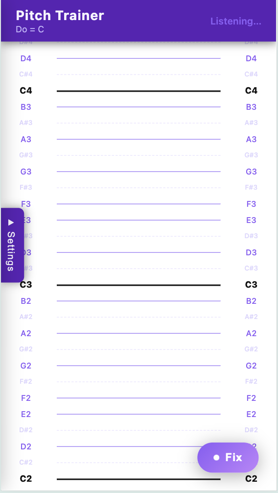
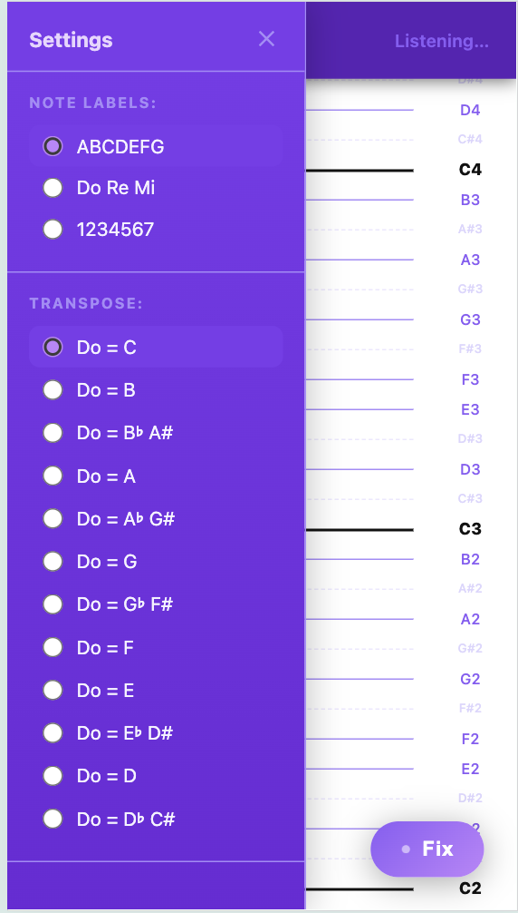
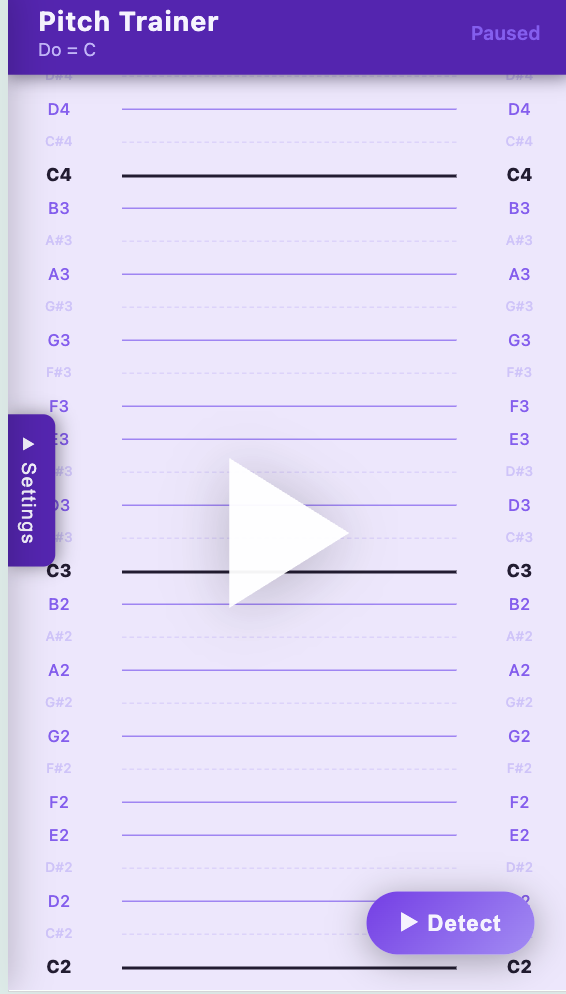

# 音準訓練 Pitch Trainer 🎵

即時音高偵測網頁應用，使用 React + Vite 建構。透過 Web Audio API 聆聽麥克風輸入，即時顯示偵測到的音符名稱、頻率，以及音準偏差（音分）。內建 **Pitch Blaster** 射擊遊戲，讓音準練習更有趣！

**🌐 線上體驗：[https://dio-chu.github.io/pitch_exercise/](https://dio-chu.github.io/pitch_exercise/)**

---

## 截圖

| 主畫面 | 設定面板 | 暫停狀態 |
|--------|----------|----------|
|  |  |  |

---

## 功能特色

### 音準訓練模式
- 即時音高偵測（透過麥克風，YIN 演算法）
- 顯示音符名稱，支援三種模式：西方記譜法（C/D/E…）、唱名（Do/Re/Mi…）、數字（1/2/3…）
- 顯示頻率（Hz）與音分偏差（cents），色彩提示音準好壞
- 支援移調，適用不同樂器
- 可點擊音符標籤播放對應音高（對照音）
- Fix / 暫停 切換按鈕，可凍結當前讀數

### Pitch Blaster 遊戲模式
- 用聲音控制瞄準，唱對音高即可擊落方塊
- 同時練習音準與樂感，支援全音階與半音
- 按右下角遊戲手把圖示進入遊戲

### 介面與設定
- 響應式排版，設定面板可收折（桌機預設展開）
- 多主題：預設 / 藍色 / 深色
- 多語系：繁體中文 / English
- 自動捲動 / 跟隨音高 切換

---

## 技術棧

- React 18
- Vite 4
- Web Audio API（YIN 音高偵測，無額外音訊函式庫）
- Hash Router（單頁應用路由：`/` 訓練模式、`#/game` 遊戲模式）

---

## 本地開發

```bash
npm install
npm run dev
```

開啟瀏覽器前往 [http://localhost:5173](http://localhost:5173)

> 應用程式需要麥克風權限，請在瀏覽器提示時允許存取。

## 建置與部署

```bash
npm run build      # 產出到 dist/
npm run deploy     # 部署到 GitHub Pages
```

---

## 專案結構

```
src/
├── App.jsx                  # 主應用，含 Hash Router
├── components/
│   ├── PitchDisplay.jsx     # 音高視覺化滾動視圖
│   ├── SettingsDrawer.jsx   # 設定抽屜
│   └── MusicGame.jsx        # Pitch Blaster 遊戲
├── hooks/
│   └── usePitchDetector.js  # 麥克風 + YIN 偵測 Hook
└── utils/
    ├── pitchDetection.js    # YIN 演算法實作
    ├── noteUtils.js         # 音名/移調工具
    └── i18n.js              # 多語系翻譯
```

---

## License

MIT
